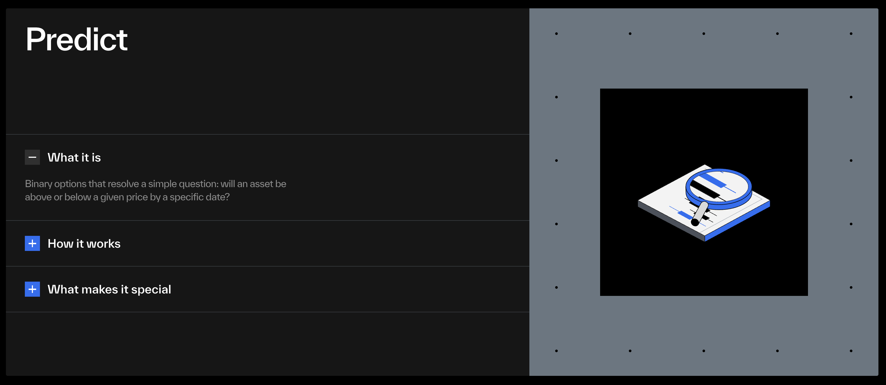

# predict-cli



DeepBook Predict from your terminal. Sui **testnet**.

Read protocol state, get fair-value quotes, mint/redeem positions, supply/withdraw LP. Signing goes through the local `sui` keystore; no private keys live in the CLI.

## Status

- Read paths (`config`, `list`, `oracle`, `vault`, `quote`): done
- Manager + writes (`deposit`, `mint`, `mint-range`, `redeem`, `redeem-range`, `supply`, `withdraw`): done
- Onboarding (`doctor`) and beginner aliases (`buy-binary`, `add-liquidity`, ...): done
- Mainnet: pending. `src/config.rs` IDs are testnet-only.

## Architecture

```
                ┌─ predict-server REST  /oracles, /managers
read   JSON-RPC ┼─ sui_getObject        live state
                └─ pricing.rs           local oracle::compute_price port
write  sui client ptb  →  ~/.sui/sui_config/sui.keystore
```

Read paths hit the public RPC and predict-server directly. Write paths build a `sui client ptb` invocation and exec the local `sui` binary, so signing reuses the keystore the user already has.

The contract endpoints wrap the `predict-testnet-4-16` branch of MystenLabs/deepbookv3:

| Move                                     | CLI                                |
|------------------------------------------|------------------------------------|
| `predict::create_manager`                | `manager --create`                 |
| `predict_manager::deposit<DUSDC>`        | `deposit`                          |
| `predict::mint<DUSDC>` (binary)          | `mint`         (alias `buy-binary`) |
| `predict::mint_range<DUSDC>`             | `mint-range`   (alias `buy-range`) |
| `predict::redeem<DUSDC>`                 | `redeem`       (alias `sell-binary`) |
| `predict::redeem_permissionless<DUSDC>`  | `redeem --permissionless`          |
| `predict::redeem_range<DUSDC>`           | `redeem-range` (alias `sell-range`) |
| `predict::supply<DUSDC>`                 | `supply`       (alias `add-liquidity`) |
| `predict::withdraw<DUSDC>`               | `withdraw`     (alias `remove-liquidity`) |

## Setup

### Prerequisites

You need the Sui CLI installed and pointed at testnet. The CLI signs through the keystore `sui` already manages.

```bash
# macOS (Homebrew)
brew install sui

# Linux / from source: see https://docs.sui.io/guides/developer/getting-started/sui-install
```

If this is your first time using `sui`, set up a testnet env and an address:

```bash
sui client new-env --alias testnet --rpc https://fullnode.testnet.sui.io
sui client switch --env testnet
sui client new-address ed25519
sui client active-address
```

### Install predict-cli

Pick whichever path you prefer. They all produce the same binary.

**Prebuilt binary (no Rust toolchain required).** Look up the latest version on the [releases page](https://github.com/SeventhOdyssey71/predict-cli/releases) and download the archive for your platform.

```bash
VERSION=v0.1.0
# pick the right target for your machine:
#   aarch64-apple-darwin       Apple Silicon Mac (M1/M2/M3/M4)
#   x86_64-apple-darwin        Intel Mac
#   x86_64-unknown-linux-musl  Linux x86_64 (statically linked, works on any distro)
#   x86_64-pc-windows-msvc     Windows x86_64 (.zip instead of .tar.gz)
TARGET=aarch64-apple-darwin

curl -L "https://github.com/SeventhOdyssey71/predict-cli/releases/download/${VERSION}/predict-cli-${VERSION}-${TARGET}.tar.gz" | tar -xz
sudo mv "predict-cli-${VERSION}-${TARGET}/predict-cli" /usr/local/bin/
predict-cli --version
```

**`cargo install` (if you have Rust ≥ 1.75).** Once the crate is published:

```bash
cargo install predict-cli
```

**From source.** This is the most reliable path while we're pre-1.0:

```bash
git clone https://github.com/SeventhOdyssey71/predict-cli
cd predict-cli
cargo install --path .
```

`cargo install --path .` puts the binary in `~/.cargo/bin/predict-cli`, which is on your `$PATH` if you installed Rust through `rustup`. If `which predict-cli` comes up empty after install, add `export PATH="$HOME/.cargo/bin:$PATH"` to your shell rc.

### Verify it works

```bash
predict-cli doctor
```

`doctor` runs every prerequisite check independently and prints the exact next command for each failure:

| Check | Fix on failure |
|-------|----------------|
| `sui` binary on `$PATH` | install `sui` (see Prerequisites) |
| active env is `testnet` | `sui client switch --env testnet` |
| active address set | `sui client new-address ed25519` |
| SUI gas balance ≥ 0.05 SUI | hit the testnet faucet (`doctor` prints the exact `curl` line) |
| DUSDC wallet balance | `predict-cli faucet` prints a Discord-ready request |
| `PredictManager` exists | `predict-cli manager --create` |

A green run looks like:

```
✓  sui binary       sui 1.68.1
✓  active env       env = testnet
✓  active address   0x33a5…8eeb
✓  sui gas          5.6002 SUI
✓  dusdc (wallet)   $1,000.00
✓  predict manager  0xabc…
ready.
```

### First trade end-to-end

Once `doctor` is fully green, a complete cycle:

```bash
# move 100 DUSDC from your wallet into the manager
predict-cli deposit --amount 100

# pick a market
predict-cli list

# preview a binary at $82k UP
predict-cli quote 0xed58…380b --strike 82000 --up --stake 10

# mint 50 binary UP units at $82k. Funds $35 from wallet,
# hard-caps spend at $40 of total manager funds.
predict-cli mint 0xed58…380b --strike 82000 --up --qty 50 --deposit 35 --max-cost 40

# after settlement, anyone can redeem on your behalf:
predict-cli redeem 0xed58…380b --strike 82000 --up --qty 50 --permissionless
```

## Commands

Add `--json` to any read command for raw output. `predict-cli <command> --help` lists flags.

### Setup
```bash
predict-cli doctor          # alias: setup
predict-cli faucet          # SUI gas + DUSDC request templates
```

### Read
```bash
predict-cli config
predict-cli list                    # active markets
predict-cli list --all              # include settled
predict-cli oracle 0xed58…380b
predict-cli vault
```

### Quote (fair value, local)
```bash
predict-cli quote 0xed58…380b --strike 82000 --up   --stake 10
predict-cli quote 0xed58…380b --strike 80000 --down --stake 25
predict-cli quote 0xed58…380b --lower 80000 --upper 84000 --stake 10
predict-cli quote 0xed58…380b --lower 80000 --stake 10           # unbounded above
```

### Manager + writes
```bash
predict-cli manager
predict-cli manager --create
predict-cli deposit --amount 100

# Binary: 50 UP units at $82k strike, fund $35, hard-cap manager spend at $40
predict-cli mint 0xed58…380b --strike 82000 --up --qty 50 --deposit 35 --max-cost 40

# Range: 50 units between $80k–$84k, fund $10
predict-cli mint-range 0xed58…380b --lower 80000 --upper 84000 --qty 50 --deposit 10

# Allow existing manager DUSDC, still capped by --max-cost
predict-cli mint 0xed58…380b --strike 82000 --up --qty 50 --deposit 5 --allow-manager-balance --max-cost 25

predict-cli redeem 0xed58…380b --strike 82000 --up --qty 50
predict-cli redeem 0xed58…380b --strike 82000 --up --qty 50 --permissionless
predict-cli redeem-range 0xed58…380b --lower 80000 --upper 84000 --qty 50

predict-cli supply --amount 1000
predict-cli withdraw 0xabcd…
```

## Agentic Perps

A managed-position layer on top of the imperative trade commands. Every existing command keeps working; `agent` is additive.

```bash
# 1. Structured intent (no LLM, fully offline)
predict-cli agent open --side up --asset BTC --tenor 1h --risk 50

# 2. Natural-language intent (default backend = offline regex; no API key)
predict-cli agent ask "long BTC for 1h, $50"

# 3. Plug in any model via OpenAI-compatible API. The agent has read-only
#    tools (list_oracles, read_oracle, list_my_positions) it can call
#    mid-conversation before producing intent.
OPENAI_API_KEY=sk-… predict-cli agent ask "long BTC for 1h, \$50"

# OpenRouter → any model on the market (Claude, Llama, Mistral, DeepSeek…)
OPENAI_API_KEY=sk-or-v1-… \
  OPENAI_BASE_URL=https://openrouter.ai/api/v1 \
  OPENAI_MODEL=anthropic/claude-sonnet-4 \
  predict-cli agent ask "fade this BTC rally for 30m, \$10"

# Local Ollama (no API key needed for local; any string will do)
OPENAI_API_KEY=ollama \
  OPENAI_BASE_URL=http://localhost:11434/v1 \
  OPENAI_MODEL=llama3 \
  predict-cli agent ask "range BTC \$25 for 1h"

# Native Anthropic /v1/messages (separate API surface, no tool use yet)
ANTHROPIC_API_KEY=… predict-cli agent ask \
  "BTC chops between 80k and 84k for the next 90 minutes, 25 dusdc" \
  --provider anthropic

# 4. List, inspect, close
predict-cli agent positions
predict-cli agent inspect <id>
predict-cli agent close <id>

# 5. Settlement daemon: redeems matured positions and (with --rolling auto) rolls into the next expiry
predict-cli agent watch                          # 30s polling, runs forever
predict-cli agent watch --once                   # one cycle, cron-friendly
predict-cli agent watch --notify-webhook https://discord.com/api/webhooks/…
predict-cli agent watch --notify-cmd 'osascript -e "display notification \"$DETAIL\" with title \"$EVENT_KIND\""'
```

The agent translates retail intent ("long BTC, $50, 1h") into a sequence of mints/redeems that read to the user as one perp position with continuous P&L. Under the hood, every transaction goes through the existing wallet caps (`--max-cost`, empty-manager-by-default, coin auto-merge) so the safety story is unchanged.

Position store lives at `$XDG_CONFIG_HOME/predict-cli/positions.json` (default `~/.config/predict-cli/positions.json`). Override with `PREDICT_CLI_STORE` for tests.

Full design: [`docs/agentic-perps.md`](docs/agentic-perps.md). Gamified mobile companion: [`docs/mobile-companion.md`](docs/mobile-companion.md).

## Spend semantics

`predict::mint<Quote>` reads from the manager's aggregate balance, not the wallet directly. The CLI defends the wallet with two structural caps:

1. **Empty-manager-by-default.** `mint`/`mint-range` abort if the manager already holds DUSDC. `--allow-manager-balance` opts in.
2. **`--max-cost <USDC>`.** Hard ceiling on `existing_manager_balance + deposit`, checked before submission.

Both bounds are enforced by limiting the available balance, never by trusting the local price preview. The contract's utilization-fee component cannot be reproduced locally without `devInspect`, so the preview is fair-value only.

## Coin handling

Deposit, mint, and supply paginate wallet DUSDC coins. If no single coin can fund the amount but the aggregate can, the CLI auto-merges the smallest sufficient set through `sui client merge-coin` before the final PTB splits the exact amount.

## Testnet IDs

Pinned in `src/config.rs`:

```
package         0xf5ea2b3749c65d6e56507cc35388719aadb28f9cab873696a2f8687f5c785138
registry        0x43af14fed5480c20ff77e2263d5f794c35b9fab7e2212903127062f4fe2a6e64
predict object  0xc8736204d12f0a7277c86388a68bf8a194b0a14c5538ad13f22cbd8e2a38028a
quote           DUSDC (6 decimals)
plp             PLP
predict-server  https://predict-server.testnet.mystenlabs.com
```

Source: docs.sui.io/onchain-finance/deepbook-predict/contract-information.

## Quality

`cargo fmt --check`, `cargo clippy -- -D warnings`, and 21 unit tests gate every PR via `.github/workflows/ci.yml`. Tests cover pricing identities, settled-payout rules, format edge cases, direction validation, and spend-cap behavior.

## Releasing

1. Bump `version` in `Cargo.toml`, commit.
2. `git tag v0.2.0 && git push origin v0.2.0`.

The release workflow runs the CI gate, builds matrix binaries (`aarch64-apple-darwin`, `x86_64-apple-darwin`, `x86_64-unknown-linux-musl`, `x86_64-pc-windows-msvc`), packages tarballs/zips with `.sha256` companions, and attaches them to a GitHub Release. Optional `cargo publish` runs only when the `CRATES_IO_TOKEN` repo secret is set.

## Layout

```
.
├── Cargo.toml
├── LICENSE
├── README.md
├── .env.example
├── .github/workflows/    # ci.yml, release.yml
├── docs/                 # banner, screenshots
└── src/
    ├── main.rs           # clap dispatch
    ├── config.rs         # testnet IDs
    ├── rpc.rs            # JSON-RPC client (read)
    ├── server.rs         # predict-server REST client
    ├── sui_cli.rs        # sui client ptb (write)
    ├── pricing.rs        # SVI binary-call port of oracle::compute_price
    ├── format.rs         # output helpers
    └── commands/
        ├── mod.rs
        ├── doctor.rs     # environment checks
        ├── config.rs
        ├── list.rs
        ├── oracle.rs
        ├── vault.rs
        ├── manager.rs
        ├── quote.rs
        ├── trade.rs      # mint, mint-range, redeem, redeem-range, deposit, supply, withdraw
        └── faucet.rs
```

## License

Apache-2.0. See [LICENSE](LICENSE).
